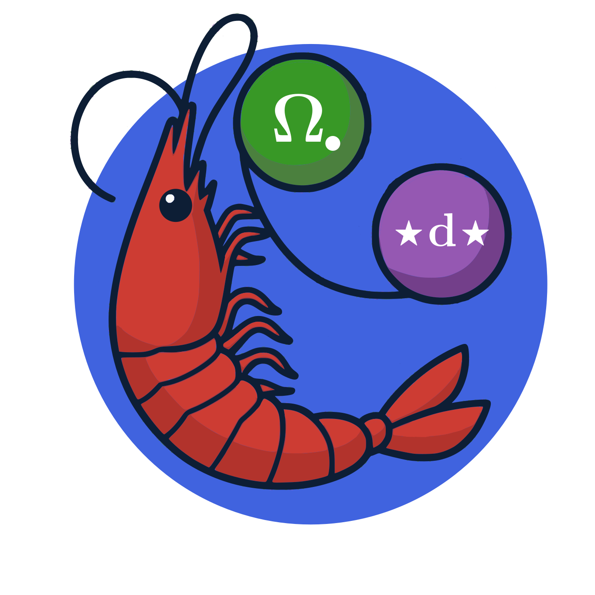

#  Decapodes.jl

Decapodes.jl is a framework for developing, composing, and simulating physical systems.

Decapodes.jl is the synthesis of Applied Category Theory (ACT) techniques for formalizing and composing physics equations, and Discrete Exterior Calculus (DEC) techniques for formalizing differential operators.
[CombinatorialSpaces.jl](https://algebraicjulia.github.io/CombinatorialSpaces.jl/dev/) hosts tools for discretizing space and defining DEC operators on simplicial complexes, and [DiagrammaticEquations.jl](https://github.com/AlgebraicJulia/DiagrammaticEquations.jl) hosts tooling for representing the equations as formal ACT diagrams. This repository combines these two packages, compiling diagrams down to simulatable code.

By combining the power of ACT and the DEC, we seek to improve the scientific computing workflow. Decapodes simulations are [hierarchically composable](https://algebraicjulia.github.io/Decapodes.jl/dev/bsh/budyko_sellers_halfar/), generalize over [any type of manifold](https://algebraicjulia.github.io/Decapodes.jl/dev/ice_dynamics/ice_dynamics/), and are [performant and accurate](https://www.cise.ufl.edu/~luke.morris/cism.html) with a declarative domain specific language (DSL) that is [human-readable](https://algebraicjulia.github.io/Decapodes.jl/dev/klausmeier/klausmeier/#Model-Representation).

# NOTE

This library is currently under active development, and so is not yet at a
point where a constant API/behavior can be assumed. That being said, if this
project looks interesting/relevant please contact us and
[let us know](https://www.algebraicjulia.org/#contributing)!
