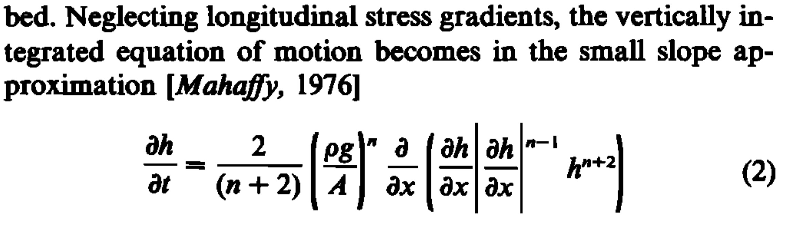

# Replicating the Community Ice Sheet Model v2.1 Halfar Dome Benchmark with Decapodes

```@setup INFO
include(joinpath(Base.@__DIR__, "..", "..", "docinfo.jl"))
info = DocInfo.Info()
```

The Decapodes framework takes high-level representations of physics equations and automatically generates solvers.

We do so by translating equations from vector calculus notation to the "discrete exterior calculus" (DEC). This process is roughly about recognizing whether physical quantities represent scalar or vector quantities, and recognizing whether differential operators represent gradient, divergence, and so on.

In this benchmark, we will implement the "small slope approximation" of glacial dynamics used by P. Halfar in his 1981 work ["On the dynamics of the ice sheets"](https://agupubs.onlinelibrary.wiley.com/doi/abs/10.1029/JC086iC11p11065) by taking his original formulation, translating it into the DEC, then providing a mesh and initial conditions.

The initial conditions used here are exactly those considered by W. H. Lipscomb et al. in ["Description And Evaluation of the Community Ice Sheet Model (CISM) v2.1" (2019)](https://gmd.copernicus.org/articles/12/387/2019/).

```@example DEC
# AlgebraicJulia Dependencies
using Catlab
using CombinatorialSpaces
using Decapodes
using DiagrammaticEquations

# External Dependencies
using BenchmarkTools
using CairoMakie
using ComponentArrays
using GeometryBasics: Point2, Point3
using JLD2
using LinearAlgebra
using MLStyle
using OrdinaryDiffEq
using SparseArrays
using Statistics
Point2D = Point2{Float64}
Point3D = Point3{Float64}
nothing # hide
```

## Specifying and Composing Physics



We will translate Halfar's equation into the DEC below. Although the equation given by Halfar is dense, this notation does not allow you to see which operators represent divergence, which components represent diffusivity constants, and so on. In the DEC, there is a small pool of operators, ⋆, d, ∧, ♯, and ♭, which combine according to set rules to encode all of these notions.

In the DEC, gradients are generalized by the exterior derivative "d". Given scalar-data, d gives the slope along edges in our mesh. Similarly, the operator (⋆, d, ⋆) generalizes divergence.

In Halfar's equation there is a term corresponding to the magnitude of the slope, but it is not clear where this quantity is to be defined. Is it a scalar-like quantity, or a vector-like quantity? In the DEC translation, we take the gradient of h, d(h), and use the "sharp" operator to define it on points in the domain, where we then take its magnitude. The "wedge product", ∧, takes care of multiplying a scalar-like quantity by a vector-like quantity.

Halfar's equation looks a little disjoint. It seems that the front most terms are responsible for computing some parameter, while the remaining terms on the right encode something about the dynamics. This is because Halfar's equation is actually describing two equations in one. The front-most term defines a quantity - depending on the strain of the ice - that controls the rate at which ice diffuses. Since this computation is rather separate from the rest of the computations involving our differential operators, we will call it "Gamma" here, and define it in a later component Decapode.

```@example DEC
# Equation 2 from Halfar, P. ON THE DYNAMICS OF THE ICE SHEETS. (1981),
# translated into the exterior calculus.
halfar_eq2 = @decapode begin
  h::Form0
  Γ::Form0
  n::Constant

  ḣ == ∂ₜ(h)
  ḣ == Γ * ∘(⋆, d, ⋆)(d(h) ∧ (mag(♯(d(h)))^(n-1)) ∧ (h^(n+2)))
end

to_graphviz(halfar_eq2)
```


Here, we recognize that Gamma is in fact what glaciologists call "Glen's Flow Law." It states that the strain rate of a sheet of ice can be related to applied stress via a power law. Below, we encode the formulation as it is usually given in the literature, depending explicitly on the gravitational constant, g.

```@example DEC
# Equation 1 from Glen, J. W. THE FLOW LAW OF ICE: A discussion of the
# assumptions made in glacier theory, their experimental foundations and
# consequences. (1958)
glens_law = @decapode begin
  Γ::Form0
  (A,ρ,g,n)::Constant
  
  Γ == (2/(n+2))*A*(ρ*g)^n
end

to_graphviz(glens_law)
```

We now need some way to compose these physics equations together. Since this physics is rather small, and there are no naming conflicts of physical quantities, this composition is also rather simple.

```@example DEC
#####################
# Compose the model #
#####################

ice_dynamics_composition_diagram = @relation () begin
  dynamics(Γ,n)
  stress(Γ,n)
end
draw_composition(ice_dynamics_composition_diagram)
```

```@example DEC
# Plug in our Decapodes to the composition pattern.
ice_dynamics_cospan = oapply(ice_dynamics_composition_diagram,
  [Open(halfar_eq2, [:Γ,:n]),
   Open(glens_law, [:Γ,:n])])

ice_dynamics = apex(ice_dynamics_cospan)
to_graphviz(ice_dynamics, verbose=false)
```

We have a representation of our composed physics. Now, we need to specify that these dynamics occur in 2 dimensions.

## Providing a Semantics

```@example DEC
# Interpret this multiphysics diagram in the 2D exterior calculus.

ice_dynamics2D = expand_operators(ice_dynamics)
infer_types!(ice_dynamics2D)
resolve_overloads!(ice_dynamics2D)
to_graphviz(ice_dynamics2D, verbose=false)
```

We are done encoding our dynamics. Now, we need to provide a mesh,  initial data to use for our quantities, and what functions to use for our differential operators.

Our mesh library, CombinatorialSpaces, can interpret arbitrary .OBJ files to run our dynamics on. Here, we use a script that generates a triangulated grid of the resolution used in the CISM benchmark. Note though that the "resolution" of a triangulated and non-triangulated grid is difficult to directly compare.

```@example DEC
s = triangulated_grid(60_000,100_000,2_000,2_000,Point3D)
sd = EmbeddedDeltaDualComplex2D{Bool, Float64, Point3D}(s)
subdivide_duals!(sd, Barycenter())
x̄ = mean(p -> p[1], point(sd))
ȳ = mean(p -> p[2], point(sd))

fig = Figure()
ax = CairoMakie.Axis(fig[1,1], aspect=0.6, xticks = [0, 3e4, 6e4])
wf = wireframe!(ax, sd; linewidth=0.5)
save("ice_mesh.png", fig)
nothing # hide
```


## Defining input data

We replicate the initial conditions and parameter values used in the CISM benchmark.

```@example DEC
# These are the initial conditions to the Halfar Dome test case that the
# Community Ice Sheet Model uses.
R₀ = 60_000 * sqrt(0.125)
H = 2_000 * sqrt(0.125)

n = 3
g = 9.8101
ρ = 910
alpha = 1/9
beta = 1/18
flwa = 1e-16
A = 1e-16

Gamma = 2.0/(n+2) * flwa * (ρ * g)^n
t0 = (beta/Gamma) * (7.0/4.0)^3 * (R₀^4 / H^7)

# This is the analytic solution for comparison.
# It is ported over from the CISM code for comparison's sake,
# and we will use it to set initial conditions.
function height_at_p(x,y,t)
  tr = (t + t0) / t0
  r = sqrt((x - x̄)^2 + (y - ȳ)^2)
  r = r/R₀
  inside = max(0.0, 1.0 - (r / tr^beta)^((n+1.0) / n))
  H * inside^(n / (2*n + 1)) / tr^alpha
end

# Set the initial conditions for ice sheet height:
# Ice height is a primal 0-form. i.e. valued at vertices.
h₀ = map(x -> height_at_p(x[1], x[2], 0), point(s))
fig = Figure()
ax = CairoMakie.Axis(fig[1,1], aspect=0.6, xticks = [0, 3e4, 6e4])
msh = mesh!(ax, s, color=h₀, colormap=:jet)
save("ice_initial_conditions.png", fig)
nothing # hide
```


```@example DEC
# Store these values to be passed to the solver.
u₀ = ComponentArray(dynamics_h = h₀)
constants_and_parameters = (
  n = n,
  stress_ρ = ρ,
  stress_g = g,
  stress_A = A)
```

We provide here the mapping from symbols to differential operators. As more of the differential operators of the DEC are implemented, they are upstreamed to the Decapodes and CombinatorialSpaces libraries. Of course, users can also provide their own implementations of these operators and others as they see fit.

```@example DEC
#############################################
# Define how symbols map to Julia functions #
#############################################

function generate(sd, my_symbol; hodge=GeometricHodge())
  # We pre-allocate matrices that encode differential operators.
  op = @match my_symbol begin
    :mag => x -> norm.(x)
    :♯  => begin
      sharp_mat = ♯_mat(sd, AltPPSharp())
      x -> sharp_mat * x
    end
    x => error("Unmatched operator $my_symbol")
  end
  return (args...) -> op(args...)
end
```

The `gensim` function takes our high-level representation of the physics equations and produces compiled simulation code. It performs optimizations such as allocating memory for intermediate variables, and so on.

```@example DEC
#######################
# Generate simulation #
#######################

sim = eval(gensim(ice_dynamics2D))
fₘ = sim(sd, generate)
```

Julia is a "Just-In-Time" compiled language. That means that functions are compiled the first time they are called, and later calls to those functions skip this step. To get a feel for just how fast this simulation is, we will run the dynamics twice, once for a very short timespan to trigger pre-compilation, and then again for the actual dynamics.

```@example DEC
# Pre-compile simulation

# Julia will pre-compile the generated simulation the first time it is run.
@info("Precompiling Solver")
# We run for a short timespan to pre-compile.
prob = ODEProblem(fₘ, u₀, (0, 1e-8), constants_and_parameters)
soln = solve(prob, Tsit5())
soln.retcode != :Unstable || error("Solver was not stable")
```

```@example DEC
# Run simulation
tₑ = 200

# This next run should be fast.
@info("Solving")
prob = ODEProblem(fₘ, u₀, (0, tₑ), constants_and_parameters)
soln = solve(prob, Tsit5(), saveat=0.1)
@show soln.retcode
@info("Done")
```

We can benchmark the compiled simulation with `@benchmarkable`. This macro runs many samples of the simulation function so we get an accurate estimate of the simulation time. The simulation time is quite fast compared to the CISM benchmarks. These results are run automatically via GitHub Actions as part of our docs build, which is not optimized for numerical simulations.

```@example DEC
# Time the simulation

b = @benchmarkable solve(prob, Tsit5(), saveat=0.1)
c = run(b)
```

Here we save the solution information to a [file](ice_dynamics2D.jld2).

```@example DEC
@save "ice_dynamics2D.jld2" soln
```

We recall that these dynamics are of the "shallow slope" and "shallow ice" approximations. So, at the edge of our parabolic dome of ice, we expect increased error as the slope increases. On the interior of the dome, we expect the dynamics to match more closely that given by the analytic model. We will see that the CISM results likewise accumulate error in the same neighborhood.


```@example DEC
# Plot the final conditions
function plot_final_conditions()
  fig = Figure()
  ax = CairoMakie.Axis(fig[1,1],
    title="Modeled thickness (m) at time 200.0",
    aspect=0.6, xticks = [0, 3e4, 6e4])
  msh = mesh!(ax, s, color=soln(200.0).dynamics_h, colormap=:jet)
  Colorbar(fig[1,2], msh)
  fig
end
fig = plot_final_conditions()
save("ice_numeric_solution.png", fig)
nothing # hide
```


```@example DEC
# Plot the final conditions according to the analytic solution.
function plot_analytic()
  hₐ = map(x -> height_at_p(x[1], x[2], 200.0), point(s))
  fig = Figure()
  ax = CairoMakie.Axis(fig[1,1],
    title="Analytic thickness (m) at time 200.0",
    aspect=0.6, xticks = [0, 3e4, 6e4])
  msh = mesh!(ax, s, color=hₐ, colormap=:jet)
  Colorbar(fig[1,2], msh)
  fig
end
fig = plot_analytic()
save("ice_analytic_solution.png", fig)
nothing # hide
```


```@example DEC
# Plot the error.
function plot_error()
  hₐ = map(x -> height_at_p(x[1], x[2], 200.0), point(s))
  h_diff = soln(tₑ).dynamics_h - hₐ
  extrema(h_diff)
  fig = Figure()
  ax = CairoMakie.Axis(fig[1,1],
    title="Modeled thickness - Analytic thickness at time 200.0",
    aspect=0.6, xticks = [0, 3e4, 6e4])
  msh = mesh!(ax, s, color=h_diff, colormap=:jet)
  Colorbar(fig[1,2], msh)
  fig
end
fig = plot_error()
save("ice_error.png", fig)
nothing # hide
```


We compute below that the maximum absolute error is approximately 89 meters. We observe that this error occurs exactly on the edge of the dome, which we expect given that this is where the "shallow slope approximation" breaks down, and the updates to our physical quantities should become more unstable. This pattern likewise occurs in the CISM benchmarks.

```@example DEC
# Compute max absolute error:
hₐ = map(x -> height_at_p(x[1], x[2], 200.0), point(s))
h_diff = soln(tₑ).dynamics_h - hₐ
maximum(abs.(h_diff))
```

We compute root-mean-square (RMS) error as well, both over the entire domain, and *excluding where the ice distribution is 0 in the analytic solution.* This is done since considering the entire domain decreases the RMS while not telling you much about the area of interest. Note that the official CISM benchmark reports `6.43` and `9.06` RMS for their two solver implementations.

```@example DEC
# Compute RMS not considering the "outside".
hₐ = map(x -> height_at_p(x[1], x[2], 200.0), point(s))
nonzeros = findall(!=(0), hₐ)
h_diff = soln(tₑ).dynamics_h - hₐ
rmse = sqrt(sum(map(x -> x*x, h_diff[nonzeros])) / length(nonzeros))
```

```@example DEC
# Compute RMS of the entire domain.
hₐ = map(x -> height_at_p(x[1], x[2], 200.0), point(s))
h_diff = soln(tₑ).dynamics_h - hₐ
rmse = sqrt(sum(map(x -> x*x, h_diff)) / length(h_diff))
```

```@example DEC
# Create a gif
begin
  frames = 100
  fig = Figure()
  ax = CairoMakie.Axis(fig[1,1], aspect=0.6, xticks = [0, 3e4, 6e4])
  msh = mesh!(ax, s, color=soln(0).dynamics_h, colormap=:jet, colorrange=extrema(soln(tₑ).dynamics_h))
  Colorbar(fig[1,2], msh)
  record(fig, "ice_dynamics_cism.gif", range(0.0, tₑ; length=frames); framerate = 30) do t
    msh.color = soln(t).dynamics_h
  end
end
```


For comparison's sake, we paste the results produced by CISM below. We observe that the error likewise accumulates around the edge of the dome, with more accurate predictions on the interior. We note that our simulation produces slight over-estimates on the interior, but there are further strategies that one can employ to increase accuracy, such as tweaking the error tolerance of the solver, and so on.

Not that since the DEC is based on triangulated meshes, the "resolution" of the CISM benchmark and the Decapodes implementation cannot be directly compared. An advantage of the DEC is that we do not need to operate on uniform grids. For example, you could construct a mesh that is finer along the dome edge, where you need more resolution, and coarser as you are farther away from the reach of the ice.


We saw in this document how to create performant and accurate simulations in the Decapodes framework, and compared against the CISM library . Although we do not expect to be both more performant and accurate compared to every hand-crafted simulation, Decapodes makes up for this difference in terms of development time, flexibility, and composition. For example, the original implementation of the Decapodes shallow ice model took place over a couple of afternoons.

Since Decapodes targets high-level representations of physics, it is uniquely suited to incorporating knowledge from subject matter experts to increase simulation accuracy. This process does not require an ice dynamics expert to edit physics equations that have already been weaved into solver code.

Further improvements to the Decapodes library are made continuously. We are creating implementations of DEC operators that are constructed and execute faster. And we are in the beginning stages of 3D simulations using the DEC.

```@example INFO
DocInfo.get_report(info) # hide
```
