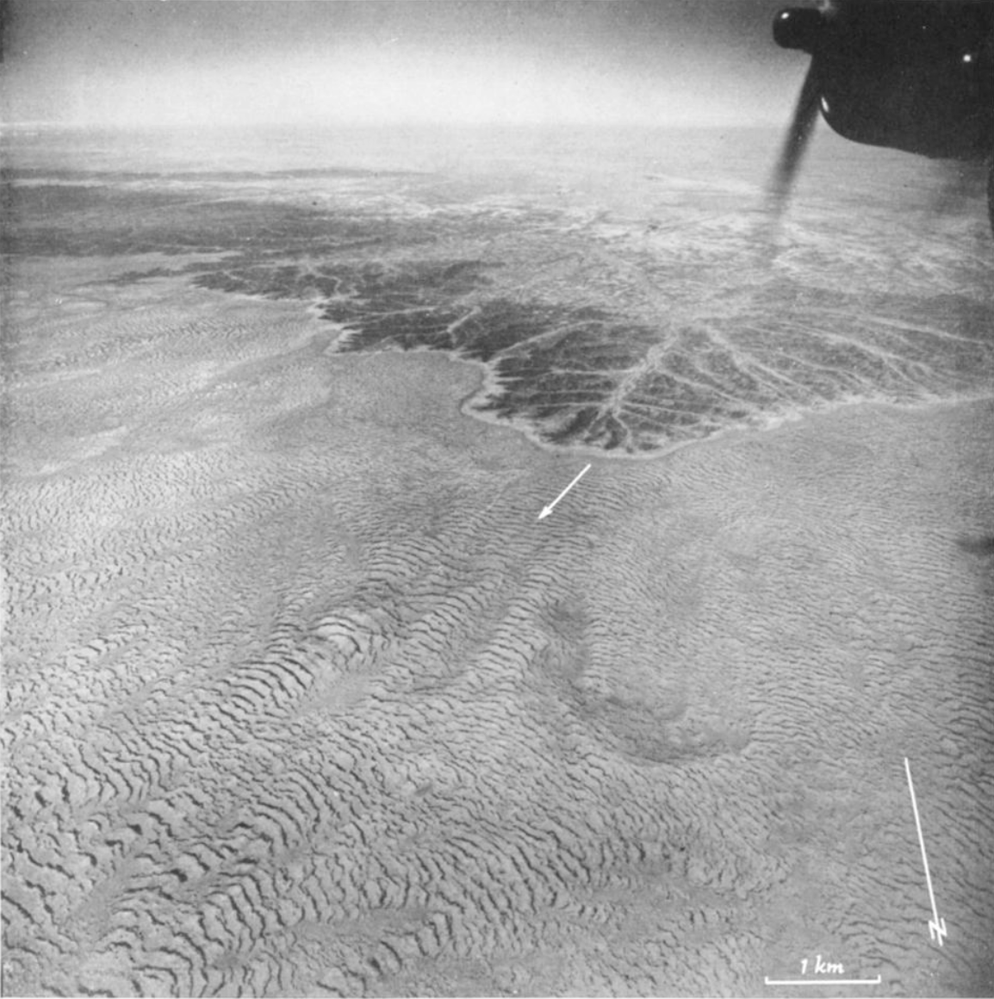

# Klausmeier

```@setup INFO
include(joinpath(Base.@__DIR__, ".." , "..", "docinfo.jl"))
info = DocInfo.Info()
```



```@raw html
<figure>
    <figcaption>One of the first aerial photographs of British Somaliland (now Somaliland) investigated by W.A. Macfadyen in his 1950 "Vegetation Patterns in the Semi-Desert Plains of British Somaliland" [1]. From this point of view, Macfadyen's "vegetation arcs" are plainly visible.</figcaption>
</figure>
```

## Background

From aerial photographs in the late 1940s, British ecologist W.A. Macfadyen discovered that vegetation in semi-arid environments often grows in striping patterns, but was unaware of the exact mechanism that causes them. What is especially striking about these "vegetation arcs" is that these stripes appear to climb uphill, with denser plant growth at the leading edge of these traveling waves. Much like how the Mandelbrot set and other interesting fractal patterns can arise from simple sets of rules, these vegetation dynamics can be explained by simple sets of partial differential equations.

The Klausmeier model, given by Christopher Klausmeier in his 1999 paper *Regular and Irregular Patterns in Semiarid Vegetation*\[2\], models such dynamics. Although Macfadyen had discovered these vegetation patterns 50s years prior\[1,3\], defining these dynamics through accessible and physically-meaningful PDEs proved a catalyst for further research. At the time of writing, Klausmeier's paper has been cited 594 times.

In this document, we will use Decapodes to formally represent these equations. Moreover, we will demonstrate how one can automatically generate simulation that reproduces the dynamics given by a scientist, simply by reading in the equations given in their original publication.

The lofty goal of this document, and of Decapodes itself, is that through both explicitly representing a model - such as Klausmeier's - and handling the generation of simulation code, we can amplify its accessibility and composability, and ultimately spur further research. Lets start by `using Decapodes`.


## using Decapodes

```@example DEC
# Load Dependencies
using CairoMakie
using Catlab
using CombinatorialSpaces
using ComponentArrays
using Decapodes
using DiagrammaticEquations
using DiagrammaticEquations.Deca
using Distributions
using GeometryBasics: Point2
using JLD2
using LinearAlgebra
using MLStyle
using OrdinaryDiffEq
Point2D = Point2{Float64}
nothing # hide
```

## Model Representation

The Klausmeier model consists of two parts: one governing plant growth (phytodynamics), and one governing hydrodynamics. The differential operator Δ represents the diffusion of vegetation, and the "Lie derivative" operator ℒ represents the change of water in a direction. In this case, the flow of water downhill, "dX".

Decapodes are written in the language of the Exterior Calculus, which generalizes Vector Calculus. For us, that means that we get to specify whether a physical quantity should valued at points in our domain (i.e. primal and dual Form0s), or whether they are more vector-like quantities, that should be valued along edges in our domain (i.e. primal and dual Form1s). In this case, water density `w` and vegetation density `n` are both Form0s, while `dX`, the gradient of our hill, is a Form1.

```@example DEC
# See Klausmeier Equation 2.a
Hydrodynamics = @decapode begin
  (n,w)::DualForm0
  dX::Form1
  (a,ν)::Constant

  ∂ₜ(w) == a - w - w * n^2 + ν * L(dX, w)
end

# See Klausmeier Equation 2.b
Phytodynamics = @decapode begin
  (n,w)::DualForm0
  m::Constant

  ∂ₜ(n) == w * n^2 - m*n + Δ(n)
end
nothing # hide
```

Now that we have our two component models, we can specify a means of composing them via a composition pattern.

```@example DEC
# Specify Composition
compose_klausmeier = @relation () begin
  phyto(N, W)
  hydro(N, W)
end

draw_composition(compose_klausmeier)
```

We apply our composition pattern by plugging in component Decapodes, and specifying which internal quantities to share along edges. Decapodes are formalized via the field of Applied Category Theory. A practical consequence here is that we can view a Decapode as a sort of computation graph.

```@example DEC
# Apply Composition
klausmeier_cospan = oapply(compose_klausmeier,
                           [Open(Phytodynamics, [:n, :w]),
                            Open(Hydrodynamics, [:n, :w])])
Klausmeier = apex(klausmeier_cospan)
to_graphviz(Klausmeier)
```

With our model now explicitly represented, we have everything we need to automatically generate simulation code. We could write this to an intermediate file and use it later, or we can go ahead and `eval`uate the code in this session.

```@example DEC
sim = eval(gensim(Klausmeier, dimension=1))
```

We now need a mesh to define our domain. In the 2D case, our CombinatorialSpaces library can read in arbitrary .OBJ files. In 1D, it is often simpler to just generate a mesh on the fly. Since we are running our physics on a circle - i.e periodic boundaries - we will use a simple function that generates it.

We will visualize the mesh embedded in two dimensions here, but in later visualizations, we can represent it as a periodic line.

```@example DEC
# Define Mesh
function circle(n, c)
  mesh = EmbeddedDeltaSet1D{Bool, Point2D}()
  map(range(0, 2pi - (pi/(2^(n-1))); step=pi/(2^(n-1)))) do t
    add_vertex!(mesh, point=Point2D(cos(t),sin(t))*(c/2pi))
  end
  add_edges!(mesh, 1:(nv(mesh)-1), 2:nv(mesh))
  add_edge!(mesh, nv(mesh), 1)
  dualmesh = EmbeddedDeltaDualComplex1D{Bool, Float64, Point2D}(mesh)
  subdivide_duals!(dualmesh, Circumcenter())
  mesh,dualmesh
end
mesh,dualmesh = circle(9, 500)

scatter(dualmesh[:point])
```

Let's pass our mesh and methods of generating operators to our simulation code.

```@example DEC
# Instantiate Simulation

lap_mat = dec_hodge_star(1,dualmesh) * dec_differential(0,dualmesh) * dec_inv_hodge_star(0,dualmesh) * dec_dual_derivative(0,dualmesh)

function generate(sd, my_symbol; hodge=DiagonalHodge())
  op = @match my_symbol begin
    :Δ => x -> begin
      lap_mat * x
    end
  end
  return (args...) -> op(args...)
end


fₘ = sim(dualmesh, generate, DiagonalHodge())
```

With our simulation now ready, let's specify initial data to pass to it. We'll define them with plain Julia code.

The most interesting parameter here is our "downhill gradient" `dX`. This parameter defines how steep our slope is. Since our mesh is a circle, and we are setting `dX` to a constant value, this means that "downhill" always points counter-clockwise. Essentially, this is an elegant way of encoding an infinite hill.

```@example DEC
# Define Initial Conditions
n_dist = Normal(pi)
n = [pdf(n_dist, t)*(√(2pi))*7.2 + 0.08 - 5e-2 for t in range(0,2pi; length=ne(dualmesh))]

w_dist = Normal(pi, 20)
w = [pdf(w_dist, t) for t in range(0,2pi; length=ne(dualmesh))]

dX = dualmesh[:length]

u₀ = ComponentArray(N = n, W = w, hydro_dX = dX)

cs_ps = (phyto_m = 0.45,
         hydro_a = 0.94,
         hydro_ν = 182.5)
```

Let's execute our simulation.

```@example DEC
# Run Simulation
tₑ = 300.0
problem = ODEProblem(fₘ, u₀, (0.0, tₑ), cs_ps)
solution = solve(problem, Tsit5(), saveat=0.1, reltol=1e-2, save_idxs=[:N, :W])
solution.retcode
```

## Animation

Let's perform some basic visualization and analysis of our results to verify our dynamics.

```@example DEC
n = solution(0).N
nₑ = solution(tₑ).N
w = solution(0).W
wₑ = solution(tₑ).W
nothing # hide
```

```@example DEC
# Animate dynamics
function save_dynamics(form_name, framerate, filename)
  time = Observable(0.0)
  ys = @lift(getproperty(solution($time), form_name))
  xcoords = [0, accumulate(+, dualmesh[:length])[1:end-1]...]
  fig = lines(xcoords, ys, color=:green, linewidth=4.0,
    colorrange=extrema(getproperty(solution(0), form_name));
    axis = (; title = @lift("Klausmeier $(String(form_name)) at $($time)")))
  timestamps = range(0, tₑ, step=1)
  record(fig, filename, timestamps; framerate=framerate) do t
    time[] = t
  end
end
save_dynamics(:N, 20, "klausmeier.gif")
```


We can observe a few interesting phenomena that we wanted to capture:

- The vegetation density bands move uphill in traveling waves.
- The leading edge of the waves is denser than the rest of the band.
- Over time, the periodicity of the vegetation bands stabilizes.
- The distribution naturally emerges, despite the initial distribution is a simple normal distribution.
  - This is evidence against the real-world theory that these vegetation contours are the result of an initial (man-made) distribution.

## Conclusion

Due to the ease of composition of Decapodes, representing the Klausmeier model opens up many areas for future work. For example, we can now compose these dynamics with a model of temperature dynamics informed by the Budyko-Sellers model. We can take advantage of the fact that the Lie derivative generalizes partial derivatives, and model the flow of water according to any vector field. Or, we can extend this model by composing it with a model that can recreate the so-called "leopard pattern" of vegetation, such as an "Interaction-Dispersion" model of vegetation dynamics given by Lejeune et al\[4\].

## References

\[1\] W. A. Macfadyen, “Vegetation Patterns in the Semi-Desert Plains of British Somaliland,” The Geographical Journal, vol. 116, no. 4/6, p. 199, Oct. 1950, doi: 10.2307/1789384.

\[2\] C. A. Klausmeier, “Regular and Irregular Patterns in Semiarid Vegetation,” Science, vol. 284, no. 5421, pp. 1826–1828, Jun. 1999, doi: 10.1126/science.284.5421.1826.

\[3\] W. A. Macfadyen, “Soil and Vegetation in British Somaliland,” Nature, vol. 165, no. 4186, Art. no. 4186, Jan. 1950, doi: 10.1038/165121a0.

\[4\] O. Lejeune and M. Tlidi, “A Model for the Explanation of Vegetation Stripes (Tiger Bush),” Journal of Vegetation Science, vol. 10, no. 2, pp. 201–208, 1999, doi: 10.2307/3237141.

```@example INFO
DocInfo.get_report(info) # hide
```
