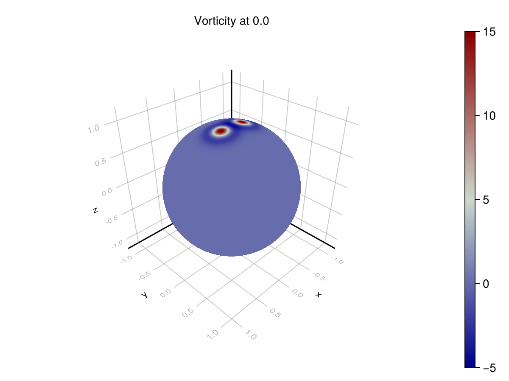
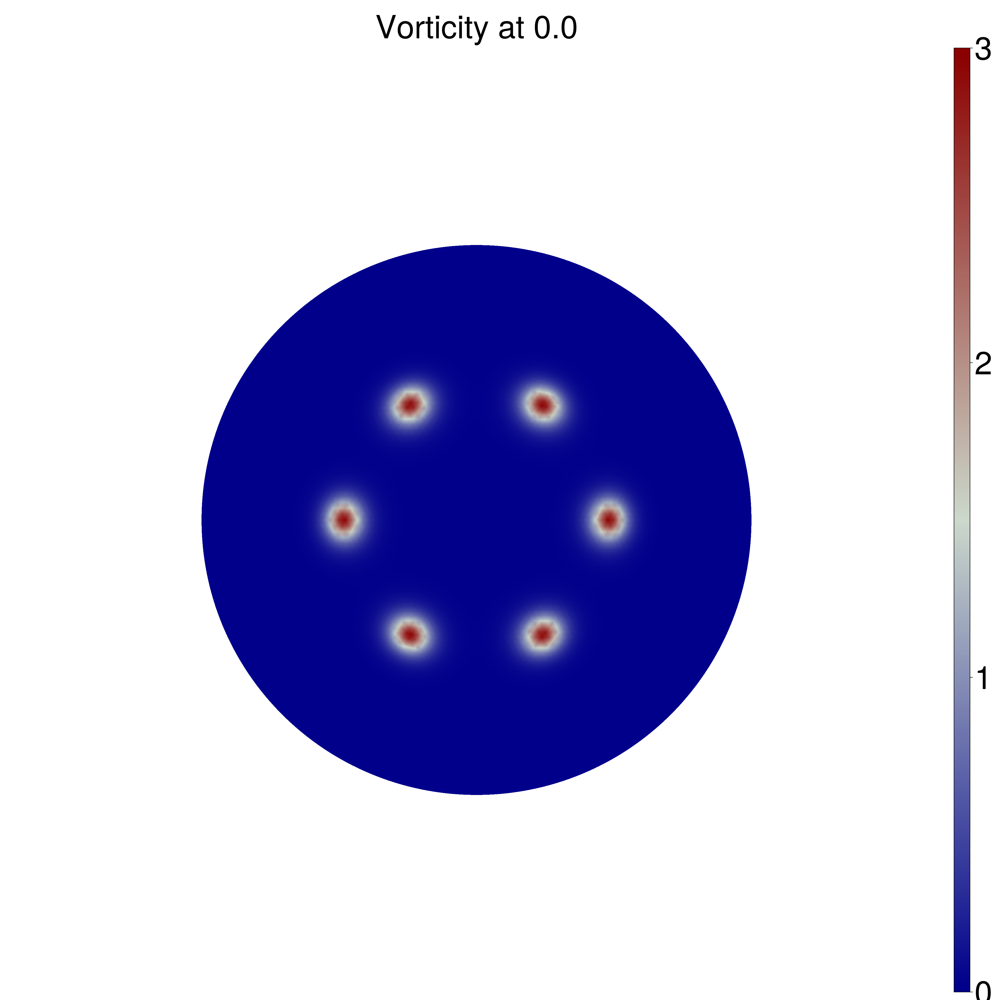
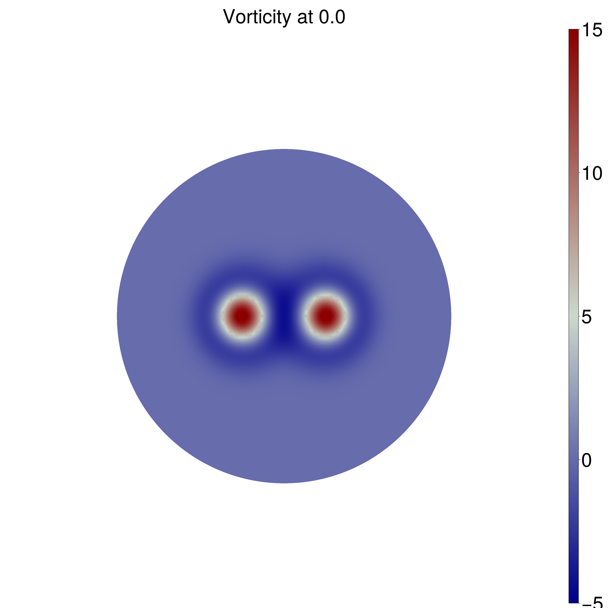

# Navier Stokes Vorticity Model

```@setup INFO
include(joinpath(Base.@__DIR__, "..", "..", "docinfo.jl"))
info = DocInfo.Info()
```




This docs page demonstrates a discretization of the invisicd incompressible Navier Stokes equations using the Discrete Exterior Calculus.

The formulations are based on those given by [Mohamed, Hirani, Samtaney](https://arxiv.org/abs/1508.01166) (in turn from [Marsden, Ratiu, Abraham](https://link.springer.com/book/10.1007/978-1-4612-1029-0)).

However, a new discretization is produced for purposes of brevity, to demonstrate novel discretizations of certain operators, and to demonstrate the automated Decapodes workflow.

The full code that generated these results is available in [a julia script](ns.jl).

Let's first demonstrate an (incorrect) formulation of the equations to demonstrate how one can iteratively develop a Decapodes model.

An initial attempt at solving the vorticity formulation of the inviscid incompressible Navier-Stokes momentum equation could be:

## Vorticity Formulation

```julia
eq11_incorrect = @decapode begin
  d𝐮::DualForm2
  𝐮::DualForm1

  𝐮 == d₁⁻¹(d𝐮)

  ∂ₜ(d𝐮) ==  (-1) * ∘(♭♯, ⋆₁, d̃₁)(∧ᵈᵖ₁₀(𝐮, ⋆(d𝐮)))
end
nothing # hide
```

In this (unstable) formulation, the velocity field is computed as the pseudo-inverse of the differential operation that computes curl.

## Initial Conditions

We can check these dynamics on a couple of test cases on the sphere with well-known analytic solutions.
In the case of dual Taylor vortices, we expect the vortices to repel one another, and in the case of a ring of (smoothed) point vortices, we should expect the vortices to rotate along the initial line of latitude. See "Wave and vortex dynamics on the surface of a sphere" (1993) from Polvani and Dritschel for analysis.

### Point Vortices



### Taylor Vortices



### Numerical Solutions (Incorrect formulation)

This formulation is very unstable for both sets of initial conditions, failing approximately 0.4% of the way into the simulation.

```verbatim
max u=NaN
│   progress = 0.004
└ @ OrdinaryDiffEqCore /blue/fairbanksj/luke.morris/julia/packages/OrdinaryDiffEqCore/H25Bn/src/integrators/integrator_utils.jl:283
┌ Warning: Instability detected. Aborting
```

```verbatim
max u=NaN
│   progress = 0.005
└ @ OrdinaryDiffEqCore /blue/fairbanksj/luke.morris/julia/packages/OrdinaryDiffEqCore/H25Bn/src/integrators/integrator_utils.jl:283
┌ Warning: Instability detected. Aborting
```

## Laplacian Solver Formulation

There are cohomological reasons why the above model formulation produces low-quality simulations. The variable **X** is physically required to be in the kernel of $\Delta$, but that isn't guaranteed by the model formulation above. To fix this, you can use the solve for the stream-function by introducing a Laplacian solve as part of the update law.

This transformation can be implemented by editing the Decapode formulation and regenerating the simulator.

```julia
eq11_inviscid_poisson = @decapode begin
  d𝐮::DualForm2
  𝐮::DualForm1
  ψ::Form0

  ψ == Δ⁻¹(⋆(d𝐮))
  𝐮 == ⋆(d(ψ))

  ∂ₜ(d𝐮) ==  (-1) * ∘(♭♯, ⋆₁, d̃₁)(∧ᵈᵖ₁₀(𝐮, ⋆(d𝐮)))
end
```

With this formulation, we achieve these numerical results:


## Phenominological Assessment

These scenarios are used to test that a simulator achieves the correct phenomenology. In the rotating point vortices case, we are looking for periodicity in the solution for vorticity. As the vortices advect around the sphere, they return to their original locations. This can be seen on the azimuthal profile. The original formulation does not exhibit this phenomenon, since it is unstable, but the corrected formulation does.

We can visualize the distribution of vorticity at the $\theta = 0.4$ latitude. The difference between the distributions at $t=0$ and $t=12$ is accumulated error.


```@example INFO
DocInfo.get_report(info) # hide
```
