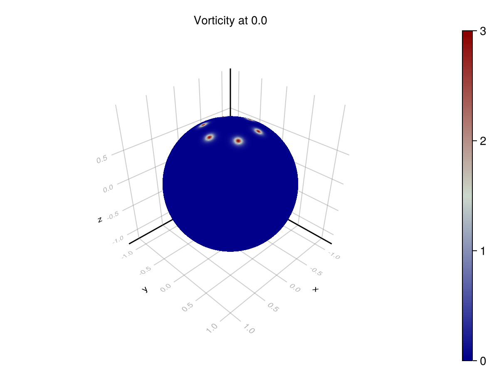
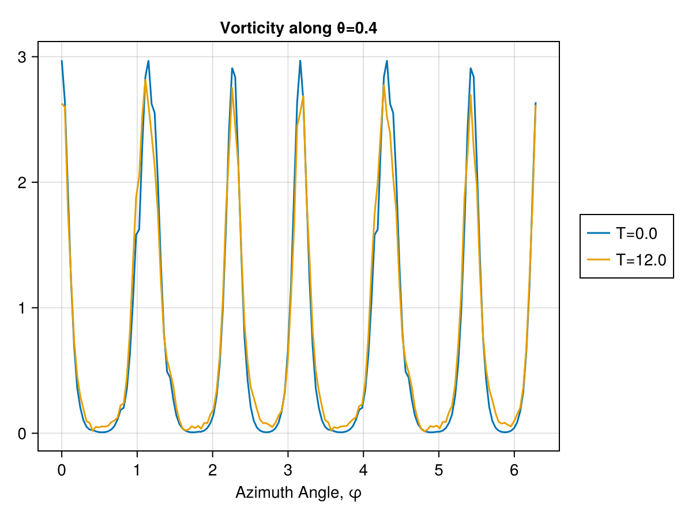

# Navier Stokes Vorticity Model

This is a discretization of the incompressible Navier Stokes equations using the Discrete Exterior Calculus.

The formulations are based on those given by [Mohamed, Hirani, Samtaney](https://arxiv.org/abs/1508.01166) (in turn from [Marsden, Ratiu, Abraham](https://link.springer.com/book/10.1007/978-1-4612-1029-0)).

However, different choices in discretization are chosen for purposes of brevity, to demonstrate novel discretizations of certain operators, and to demonstrate the automated Decapodes workflow.

The different formulations are given in the following decapode expressions.

```julia
eq11_vorticity = @decapode begin
  d𝐮::DualForm2
  𝐮::DualForm1
  μ::Constant

  𝐮 == d₁⁻¹(d𝐮)

  ∂ₜ(d𝐮) == μ * ∘(⋆, d, ⋆, d)(d𝐮) + (-1) * ∘(♭♯, ⋆₁, d̃₁)(∧ᵈᵖ₁₀(𝐮, ⋆(d𝐮)))
end

eq11_inviscid_vorticity = @decapode begin
  d𝐮::DualForm2
  𝐮::DualForm1

  𝐮 == d₁⁻¹(d𝐮)

  ∂ₜ(d𝐮) ==  (-1) * ∘(♭♯, ⋆₁, d̃₁)(∧ᵈᵖ₁₀(𝐮, ⋆(d𝐮)))
end

eq11_inviscid_poisson = @decapode begin
  d𝐮::DualForm2
  𝐮::DualForm1
  ψ::Form0

  ψ == Δ⁻¹(⋆(d𝐮))
  𝐮 == ⋆(d(ψ))

  ∂ₜ(d𝐮) ==  (-1) * ∘(♭♯, ⋆₁, d̃₁)(∧ᵈᵖ₁₀(𝐮, ⋆(d𝐮)))
end

eq17_stream = @decapode begin
  ψ::Form0
  u::DualForm1
  v::Form1
  μ::Constant

  u == ⋆(d(ψ))
  v == ⋆(u)

  ∂ₜ(ψ) == dsdinv(
                  μ * ∘(d, ⋆, d, ⋆, d, ⋆, d)(ψ) -
                  ∘(⋆₁, d̃₁)(v ∧ ∘(d,⋆,d,⋆)(ψ)))
end

eq17_inviscid_stream = @decapode begin
  ψ::Form0
  u::DualForm1
  v::Form1

  u == ⋆(d(ψ))
  v == ⋆(u)

  ∂ₜ(ψ) == -1 * dsdinv(∘(⋆₁, d̃₁)(v ∧ ∘(d,⋆,d,⋆)(ψ)))
end
```

Our initial conditions of interest are either Taylor or Point vortices

```julia
function taylor_vortex(pnt::Point3D, cntr::Point3D, p::TaylorVortexParams)
  gcd = great_circle_dist(pnt,cntr)
  (p.G/p.a) * (2 - (gcd/p.a)^2) * exp(0.5 * (1 - (gcd/p.a)^2))
end

function point_vortex(pnt::Point3D, cntr::Point3D, p::PointVortexParams)
  gcd = great_circle_dist(pnt,cntr)
  p.τ / (cosh(3gcd/p.a)^2)
end
```

Based on the configuration, you can see different results that match the expected solutions from the literature.

Here is one set of results from using the inviscid Poisson formulation:



These vortices should be stable so we should see the same periodic function for both lines here. The difference between the lines is the accumulated error.

